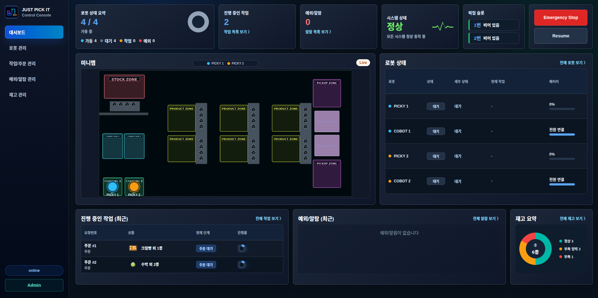
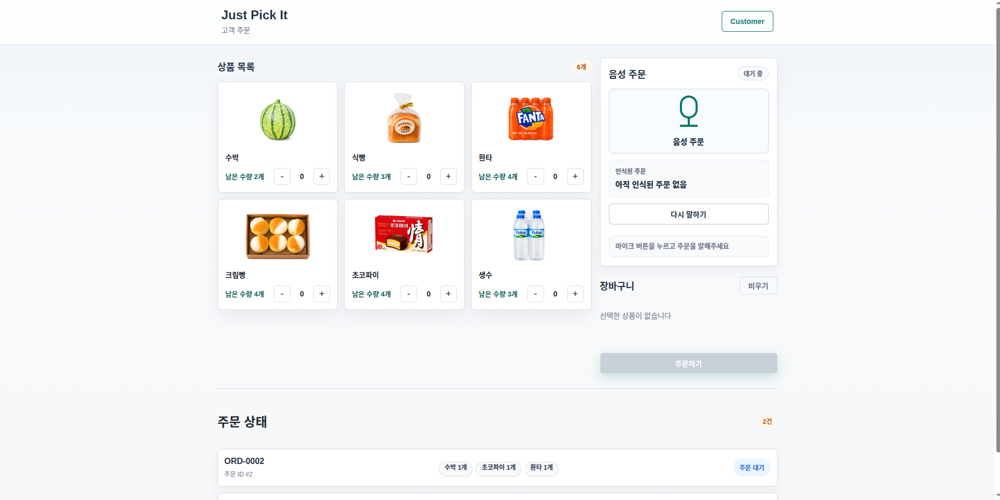
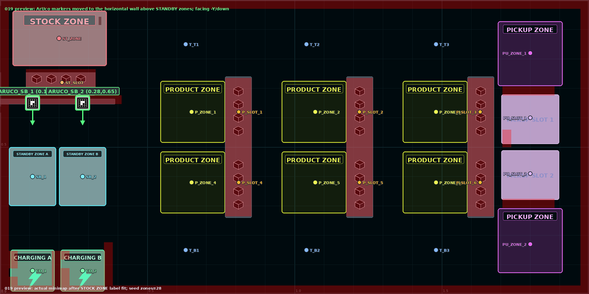
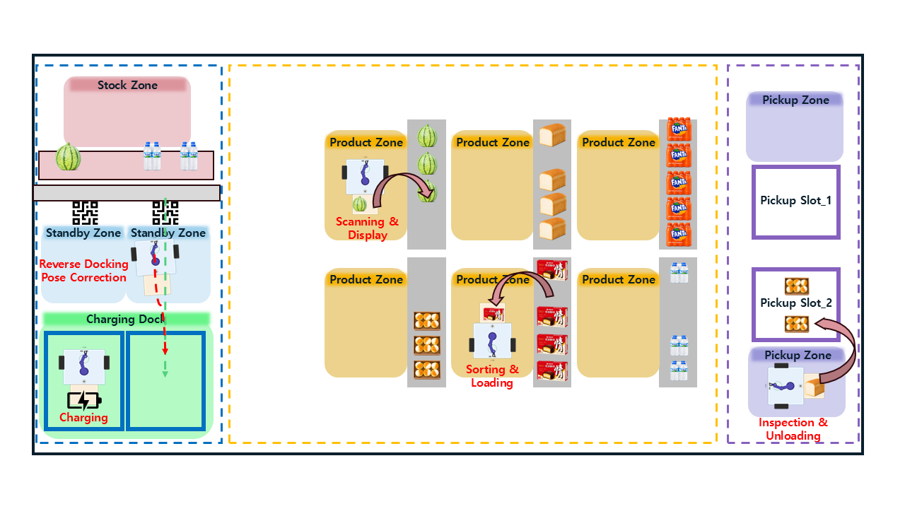
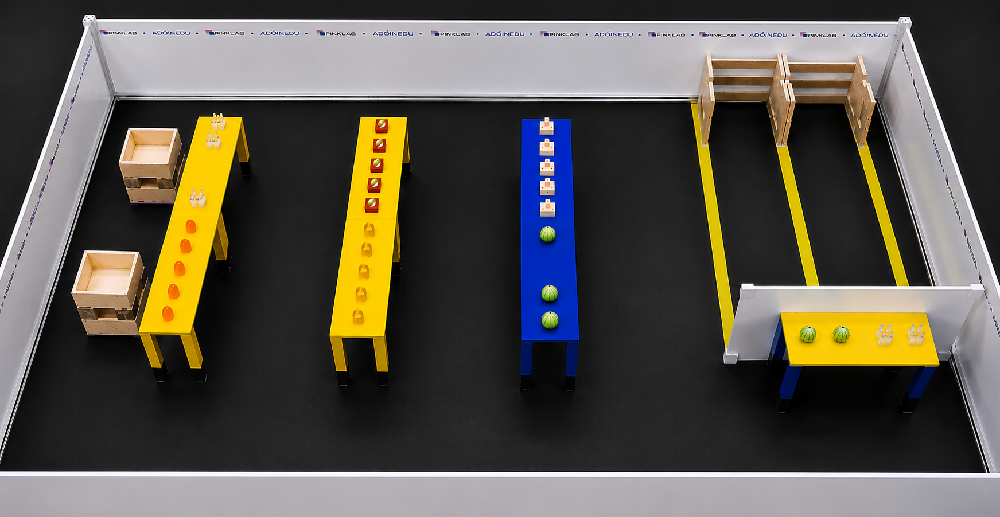
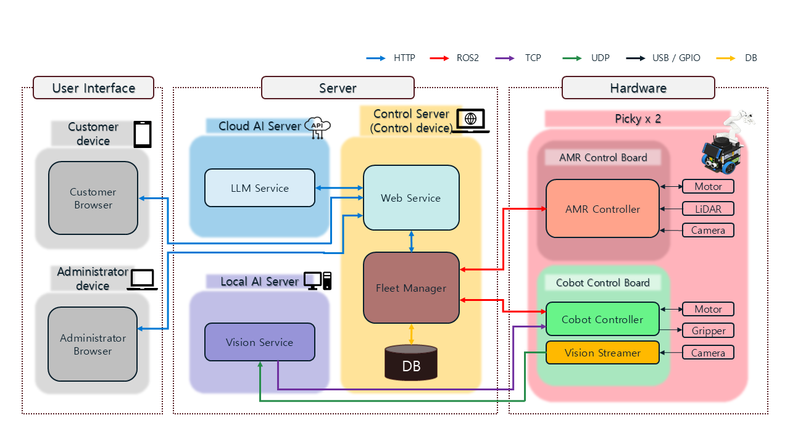
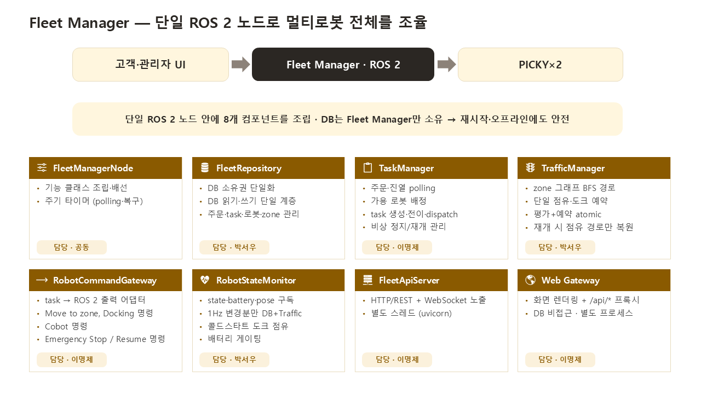
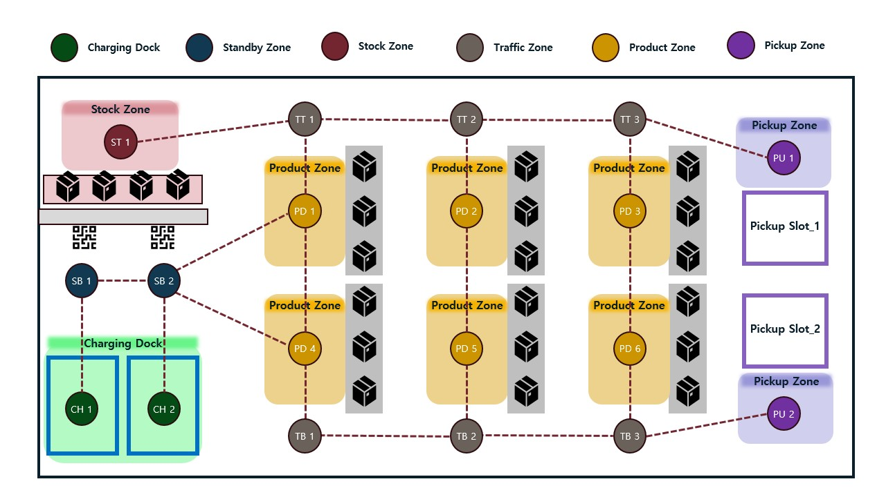
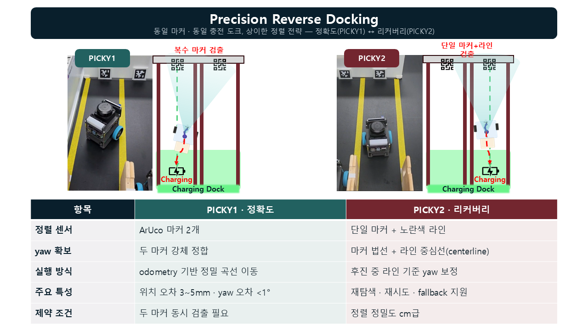

# JUST PICK IT

ROS 2 기반 멀티 로봇 물류 자동화 시스템입니다. Customer UI에서 들어온 주문을 Fleet Manager가 작업 단위로 분해하고, AMR(PICKY) 2대와 COBOT 2대를 연동해 상품 이동, 적재, 픽업, 진열 흐름을 자동화합니다.

이 저장소는 단일 로봇 데모가 아니라 Web, DB, Fleet orchestration, AMR navigation, COBOT manipulation, Vision, ROS 2 action/service/topic 통신을 하나의 시나리오로 연결한 팀 프로젝트 워크스페이스입니다.

<p align="center">
  
  
</p>
<p align="center">
  
</p>

## At A Glance

| Category | Details |
|---|---|
| System Scope | Customer/Admin Web, Fleet Manager, DB, AMR, COBOT, Vision |
| Robots | PICKY AMR 2대, COBOT 2대 |
| Runtime Integration | HTTP, WebSocket, ROS 2 action/service/topic, UDP camera stream, TCP vision result bridge |
| Main Scenario | 주문 접수 -> AMR 이동 -> COBOT 적재/진열 -> 상태/재고 갱신 |
| Validation | 실로봇 주행/도킹 테스트, fake robot 기반 통합 테스트, rosbag 분석 |
| Collaboration | Confluence 문서화, Jira 이슈 관리, Slack 커뮤니케이션 |

## Project Overview

JUST PICK IT은 소형 물류 매장 또는 자동화 매대를 가정한 통합 로봇 시스템입니다.

- 고객은 Web UI에서 상품을 주문합니다.
- Fleet Manager는 주문, 재고, 로봇 상태를 바탕으로 작업을 생성합니다.
- Traffic Manager는 zone graph 기반 경로와 점유 상태를 관리합니다.
- AMR은 Nav2 기반으로 stock, product, pickup, charging zone을 이동합니다.
- COBOT은 AMR과 연동해 상품 적재, 검사, 진열 작업을 수행합니다.
- Admin UI는 로봇 상태, 작업 진행률, 예외/알람, 재고 상태를 실시간으로 보여줍니다.

## Workspace Layout

실제 시연 공간은 stock zone, standby/charging zone, product zone, pickup zone으로 나뉩니다. AMR은 zone graph를 따라 이동하고, COBOT은 stock/product/pickup 흐름에서 적재와 진열 작업을 수행합니다.

<p align="center">
  
</p>
<p align="center">
  
</p>

## System Architecture

아래 구조는 Web, Cloud/Local AI server, Control server, AMR/COBOT hardware가 HTTP, ROS 2, TCP, UDP, USB/GPIO, DB 통신으로 연결되는 전체 시스템 구성을 보여줍니다.

<p align="center">
  
</p>

### Main Runtime Flow

```text
Customer UI
-> Web Gateway
-> Fleet API
-> Task Manager
-> Traffic Manager
-> Robot Command Gateway
-> AMR MoveCommand / DockCommand
-> COBOT ExecuteTask
-> DB state update
-> Admin UI realtime update
```

## Core Features

| Area | Feature |
|---|---|
| Customer UI | 상품 주문, 요청 상태 확인 |
| Admin UI | 로봇 상태, 작업 슬롯, 예외/알람, 재고 현황, minimap 관제 |
| Fleet Manager | 주문/진열 요청을 task sequence로 변환하고 로봇 명령 송신 |
| Task Manager | 주문, 입고, 진열, 복귀, 도킹 작업 상태 전이 관리 |
| Traffic Manager | zone graph 기반 경로 생성, waypoint 예약/해제, 다중 AMR 경로 충돌 완화 |
| AMR Navigation | ROS 2 Nav2, AMCL, waypoint 이동, obstacle stop, reverse docking |
| COBOT Workflow | 상품 적재, 검사, 진열 작업을 ROS 2 action server로 수행 |
| Integration Test | 실로봇, fake AMR, fake COBOT 조합으로 통합 시나리오 검증 |

## Technical Highlights

### Fleet Orchestration

<p align="center">
  
</p>

Fleet Manager는 Web/API 요청과 실제 로봇 action 사이의 중간 계층입니다. Web은 DB를 직접 수정하지 않고 Fleet API를 통해 주문과 작업을 요청하며, Fleet Manager 내부에서 Task Manager, Traffic Manager, RobotCommandGateway, RobotStateMonitor가 각 책임을 나눠 처리합니다.

이 구조는 다음 문제를 분리합니다.

- UI 요청과 로봇 실행 시점 분리
- DB 상태와 ROS 2 action 결과 동기화
- 주문, 진열, 복귀, 도킹 task 흐름 추적
- fake robot server를 이용한 하드웨어 없는 통합 테스트

### Multi-Robot Traffic Management

AMR 2대가 같은 좁은 맵에서 움직이기 때문에 단순 최단 경로만으로는 충돌 가능성이 있습니다. Traffic Manager는 매장을 **zone graph**로 추상화하고, 한 zone에는 로봇 1대만 들어가도록 경로를 예약/해제합니다. Nav2의 실제 좌표 주행과 독립적으로 노드/엣지 단위 통행권만 관리하므로, 로봇 주행 스택이 달라도 동일하게 적용됩니다.

#### Zone Node Graph

<p align="center">
  
</p>

`TrafficManager`의 `ZONE_GRAPH`가 위 그래프를 그대로 코드화한 인접 리스트입니다.

| Node | Graph label | 설명 |
|---|---|---|
| `CHARGING_DOCK_1/2` | CH1, CH2 | 충전 도크 (reverse docking 종착) |
| `STANDBY_ZONE_1/2` | SB1, SB2 | 도크 진입 대기 zone |
| `STOCK_ZONE` | ST1 | 창고 (진열 task 상차 지점) |
| `TRAFFIC_T1~T3` | TT1~TT3 | 상단 복도 (단차선 양방향) |
| `TRAFFIC_B1~B3` | TB1~TB3 | 하단 복도 (단차선 양방향) |
| `PRODUCT_ZONE_1~6` | PD1~PD6 | 진열대 (열별 상/하 2개) |
| `PICKUP_ZONE_1/2` | PU1, PU2 | 픽업존 (각 복도 끝) |

토폴로지 설계 포인트:

- **좌측 수직 복도 제거(v2.1):** 초기 설계의 좌측 TL 열은 노드 간격이 너무 촘촘해 회피가 어려웠습니다. 제거하고 `STANDBY_ZONE_2`가 `PRODUCT_ZONE_1/4`로 직접 진입하도록 재설계했습니다.
- **안쪽 도크 안전:** `STANDBY_ZONE_1`은 반드시 `STANDBY_ZONE_2`를 거쳐야 외부로 진출합니다.
- **수직 단차선:** 각 상품 열 내부(`TT(i) - PD(i) - PD(i+3) - TB(i)`)는 한 줄로만 오갑니다.

#### Reservation And Occupancy

경로 평가(BFS)와 예약 등록을 단일 lock 안에서 atomic하게 수행합니다. 평가 후 예약 사이에 다른 로봇이 같은 노드를 점유하는 race를 차단하기 위함입니다.

- **단일 점유(한 zone 1대):** 예약된 경로의 노드와 엣지를 모두 차단합니다. 다른 로봇 BFS는 차단 노드를 목적지여도 통과하지 못합니다.
- **최근접 자동 선정:** 후보 zone(남은 상품의 zone들) 중 도달 가능하고 BFS hop이 가장 적은 곳을 한 번에 평가/예약합니다.
- **충전 도크 예약:** 안쪽 도크 우선순위로 빈 도크에만 도킹합니다. 귀환 시점에 목적 도크를 함께 점유해 두 로봇이 같은 도크로 향하는 race를 막고, **콜드 스타트 시 양쪽 도크를 점유 상태로 시작**해 부팅 직후 복귀 로봇의 충돌을 차단합니다.

주요 검증 포인트는 다음과 같습니다.

- waypoint 순서 보존
- pickup/product/traffic zone 교차 구간 점유 관리
- 로봇이 지나간 waypoint 해제 타이밍
- 작업 재시작 또는 도킹 후 다음 작업 source zone 갱신

### AMR Navigation And Docking

PICKY AMR은 ROS 2 Nav2 기반으로 주행합니다. 실환경에서는 맵 크기와 통로 폭이 매우 작아 일반적인 기본 Nav2 값만으로는 안정적인 주행이 어렵기 때문에, AMCL, costmap, goal tolerance, controller, obstacle stop 파라미터를 실주행 로그 기반으로 조정했습니다.

PICKY1(`pinky_amr_1`)과 PICKY2(`pinky_amr_2`)는 **같은 Fleet 명령 계약(`MoveCommand`/`DockCommand`/`EmergencyControl`)을 공유하지만, 주행 상태 머신과 reverse docking은 각각 독립적으로 개발되어 구현 스택이 다릅니다.** 계약이 같으므로 Fleet Manager·Traffic 입장에서는 두 로봇을 동일하게 다루고, 구현 차이는 각 AMR 패키지 내부에 캡슐화됩니다.

#### Navigation Execution

| 항목 | PICKY1 (`pinky_amr_1`) | PICKY2 (`pinky_amr_2`) |
|---|---|---|
| Nav2 호출 | waypoint별 `NavigateToPose` 반복 | `NavigateThroughPoses` 전체 경로 일괄 |
| 경유지/Traffic | waypoint feedback index +1로 통과 후 점유 단계 순차 해제 | 일괄 주행 중 잔여 pose feedback |
| 비상정지 | EmergencyLatch (Event + Lock, pause-continue 래치) | EmergencyGuard (bool 플래그) |
| 트레이드오프 | waypoint 단위 반복으로 **pose 정밀도 우수**, 속도는 느림 | 경로 일괄 주행으로 **속도 빠름**, pose 정밀도는 낮음 |

PICKY1은 매대 정밀 접근 시 Nav2로 근처까지 이동한 뒤, precision 영역 안에서는 Nav2를 취소하고 `cmd_vel` 저속 직진 + TF yaw 보정으로 매대 약 2cm 앞에서 떨림 없이 정지합니다.

#### Reverse Docking

좁은 charging dock에 후진 삽입하는 동작도 두 로봇이 서로 다른 정렬 방식을 사용합니다.

<p align="center">
  
</p>

| 항목 | PICKY1 | PICKY2 |
|---|---|---|
| 정렬 센서 | ArUco marker **2개** (AprilTag 36h11) | 단일 marker + guide lane line 검출 |
| yaw 확보 | 두 marker translation 강체정합 (pose-flip 없음) | marker corner 기반 화면 기준선과 guide lane centerline 픽셀오차 보정 |
| 실행 | marker 1회 측정 후 odom 정밀 곡선 이동 | marker distance 정지 + 후진 중 line yaw 보정 |
| 강점 | 초정밀 (lateral 3~5mm, yaw < 1°) | 실패 복원 (재탐색, escape 재시도, line fallback) |
| 트레이드오프 | 두 marker 동시 검출 필요 | 정렬 정밀도는 cm 급 |

- 공통: charging dock별 marker id와 map pose 관리, 도킹 단계에서 카메라 활성화, marker pose 기반 정렬, debug image와 rosbag으로 실주행 실패 원인 분석.
- PICKY2는 marker distance 기반 정지와 실패 시 escape 후 재시도(line fallback 포함)로 안정성을 확보합니다.
- PICKY1은 단일 평면 marker의 yaw가 pose-flip으로 취약한 점을 피하기 위해, dock의 두 marker translation만 강체정합해 헤딩을 ambiguity 없이 잡고 odom으로 정밀 실행합니다. 후진 0.33m에서 횡오차 1cm 이내 제약(`yaw <= 1.7°`)을 기하로 역산한 설계이며, 자세한 내용은 [Reverse Docking Design](docs/Reverse_Docking_Design.md)을 참고하세요.

### ROS 2 Discovery And Debugging

멀티 로봇을 같은 ROS_DOMAIN_ID에서 실행하면 DDS discovery, Wi-Fi multicast, lifecycle bond timeout 문제가 발생할 수 있습니다. 이 프로젝트는 실행 환경에 맞춰 FastDDS Discovery Server, ROS_DOMAIN_ID 분리, bridge 구성 같은 대응 전략을 검토하고, 디버깅용 rosbag 기록 스크립트를 따로 제공합니다.

디버깅 도구는 다음 정보를 우선 기록합니다.

- `/picky*/odom`
- `/picky*/scan`
- `/picky*/tf`, `/picky*/tf_static`
- Nav2 action/lifecycle 상태
- AMR state machine 로그
- 도킹 debug image

## Engineering Challenges

이 프로젝트는 Web 서비스와 실제 로봇 제어를 동시에 다루기 때문에, 단순 기능 구현보다 **상태 동기화, 로봇 간 충돌 가능성, 실환경 센서/네트워크 불안정성**을 해결하는 데 많은 비중이 있었습니다.

| Challenge | What Happened | Resolution |
|---|---|---|
| Multi-robot task orchestration | 주문, 진열, 복귀, 도킹이 서로 다른 로봇 action 결과와 DB 상태에 걸쳐 진행되어 task 흐름이 꼬일 수 있었습니다. | Fleet API, Task Manager, Fleet Repository, Robot Command Gateway로 책임을 나누고, task 상태 전이와 action result callback을 기준으로 다음 단계를 진행하도록 구성했습니다. |
| Traffic conflict in narrow map | PICKY 2대가 product/pickup/traffic zone을 동시에 지나가면 같은 waypoint를 공유하거나 반대 방향으로 진입할 수 있었습니다. | Traffic Manager가 zone graph 기반으로 경로를 예약하고, waypoint feedback을 받아 지나간 구간을 해제하도록 설계했습니다. source zone 갱신과 pickup/product zone 병목도 별도 검증 대상으로 관리했습니다. |
| Nav2 tuning in small workspace | 약 2m x 1m 수준의 좁은 맵과 25~37cm 통로에서는 기본 Nav2 파라미터가 너무 보수적이거나, 반대로 목표 도착 판정이 어긋나는 문제가 있었습니다. | AMCL beam/particle, goal tolerance, costmap, controller, obstacle stop 값을 rosbag과 RViz 관측 기반으로 조정했습니다. |
| Reverse docking reliability | 단순 odom 후진 거리만으로는 charging dock 정렬이 안정적이지 않았고, 마커 탐색/정렬 실패 시 벽에 닿거나 marker를 잃는 문제가 있었습니다. | ArUco marker pose 기반 정렬, marker distance 기반 정지, retry escape, target marker 재탐색, debug image 저장을 추가해 실패 원인을 추적 가능하게 만들었습니다. |
| ROS 2 discovery over Wi-Fi | 여러 로봇과 PC가 같은 ROS_DOMAIN_ID에서 실행될 때 action server/lifecycle node가 늦게 보이거나 일부 토픽 주기가 떨어지는 현상이 있었습니다. | FastDDS Discovery Server, ROS_DOMAIN_ID 분리, bridge 구조를 비교 검토하고, 실행 런북과 `dds_env.sh`, rosbag debug recorder로 재현/분석 절차를 정리했습니다. |
| Emergency stop and resume | Emergency Stop 후 action이 취소되거나 실패한 task를 그대로 RUNNING으로 되돌리면 resume 시 경로와 로봇 상태가 불일치할 수 있었습니다. | resume 시 task를 재배정 가능한 상태로 되돌리고, 현재 pose 기반으로 source zone을 다시 계산해 경로를 재예약하도록 보정했습니다. |
| Display task workflow | 주문으로 재고가 부족해졌을 때 자동진열이 새 주문보다 먼저 배정되거나, 기존 진열 batch에 잘못 붙는 문제가 있었습니다. | 자동진열 생성 시점을 주문 첫 task 실행 시점과 열린 진열 batch 상태에 맞춰 조정하고, COBOT의 `DISPLAY_PLACE`가 스캔부터 진열까지 처리하는 4-task 흐름으로 단순화했습니다. |

## Collaboration And Project Management

팀 프로젝트 산출물과 협업 흐름은 코드와 함께 관리했습니다.

| Tool | Usage |
|---|---|
| Confluence | 요구사항, 시스템 아키텍처, task scenario, interface specification 문서 작성 |
| Jira | 작업 단위, 이슈, 진행 상태, 담당 흐름 관리 |
| Slack | 실험 결과, 장애 로그, 현장 테스트 상황, 빠른 의사소통 공유 |
| Git / GitHub | 기능 브랜치, 커밋 이력, 팀원 작업 통합 관리 |

Confluence 문서는 PDF로 export해 `docs/`에 보관했고, 실행 절차와 디버깅 과정에서 반복적으로 필요한 내용은 markdown runbook으로 별도 정리했습니다.

## Tech Stack

| Layer | Stack |
|---|---|
| Robot Middleware | ROS 2 Jazzy |
| AMR Navigation | Nav2, AMCL, Costmap, Regulated Pure Pursuit |
| Robot Perception | LiDAR, OpenCV ArUco, camera debug image |
| Robot Control Interface | ROS 2 action, service, topic |
| Backend | Python, FastAPI |
| Database | PostgreSQL |
| Frontend | HTML, CSS, JavaScript |
| Realtime Update | WebSocket, HTTP fallback polling |
| Debugging | rosbag2, MCAP, RViz, tmux, shell runbooks |
| Collaboration | Jira, Confluence, Slack, GitHub |
| Simulation / External Packages | Gazebo, Pinky Pro packages |

## Repository Layout

```text
just_pick_it/
├── db/                         # PostgreSQL schema, seed, DB notes
├── docs/                       # 설계 문서, 실행 런북, 시스템 설명 자료
├── scripts/
│   ├── build_tools/            # PICKY별 colcon build helper
│   ├── demo/                   # fake robot, full-flow demo helpers
│   ├── navigation/             # PICKY bringup/nav/state/debug scripts
│   ├── runtime/                # Fleet Manager + Web Gateway 실행
│   └── setup/                  # workspace reset, demo DB reset
├── src/
│   ├── just_pick_it/
│   │   ├── fleet_manager/      # Fleet API, TaskManager, TrafficManager, robot gateway
│   │   ├── just_pick_it_db/    # DB service layer
│   │   ├── just_pick_it_interfaces/
│   │   ├── picky_cobot_1/      # COBOT runtime package
│   │   ├── pinky_amr_1/        # PICKY1 runtime package
│   │   └── pinky_amr_2/        # PICKY2 navigation, docking, state machine
│   ├── pinky_pro/              # Pinky Pro vendor/reference packages
│   └── sllidar_ros2/           # SLAMTEC LiDAR driver
└── web/                        # Customer/Admin UI and Web Gateway
```

## Running The System

루트 README는 전체 구조를 보여주는 용도입니다. 실제 실행 순서는 장비 조합에 따라 달라지므로 아래 런북을 기준으로 실행합니다.

- [전체 시스템 실행 런북](docs/System_Execution_Runbook.md)
- [Web Gateway README](web/README.md)
- [DB README](db/README.md)
- [Fake Robot Demo README](scripts/demo/README.md)

기본적인 관제 PC 실행 흐름은 다음과 같습니다.

```bash
cd ~/just_pick_it
bash scripts/setup/reset_demo_data.sh
bash scripts/runtime/run_all.sh
```

실제 로봇 통합 테스트는 Discovery Server, PICKY1/PICKY2 보드, COBOT 호스트, AI PC 실행 순서를 맞춰야 합니다. 자세한 순서는 [System_Execution_Runbook.md](docs/System_Execution_Runbook.md)를 확인하세요.

## Documentation Map

요구사항, 시스템 아키텍처, 시나리오, 인터페이스 문서는 Confluence에서 관리한 내용을 PDF로 export해 `docs/`에 보관했습니다. 작업 단위와 이슈 흐름은 Jira를 기준으로 관리했고, 실험 로그와 빠른 상황 공유는 Slack을 활용했습니다.

| Document | Purpose |
|---|---|
| [Project Topic](docs/0_Project_Topic.pdf) | 프로젝트 주제와 목표 |
| [User Requirements](docs/1_User_Requirements.pdf) | 사용자 요구사항 |
| [System Requirements](docs/2_System_Requirements.pdf) | 시스템 요구사항 |
| [System Architecture](docs/3_System_Architecture.pdf) | 전체 시스템 아키텍처 |
| [Task Scenario](docs/4_Task_Scenario.pdf) | 주문/진열 작업 시나리오 |
| [Data Structure](docs/6_Data_Structure.pdf) | 데이터 구조 |
| [Interface Specification](docs/7_interface_specification.pdf) | 주요 인터페이스 명세 |
| [System Execution Runbook](docs/System_Execution_Runbook.md) | 실로봇, fake robot 조합별 실행 순서 |
| [Fleet Manager](docs/Fleet_manager.md) | Fleet Manager 구조와 주요 흐름 |
| [Fleet Manager Interface](docs/Fleet_manager_interface.md) | Fleet 연동 인터페이스 |
| [Order Scenario Test Guide](docs/Order_Scenario_Test_Guide.md) | 주문 시나리오 테스트 흐름 |
| [Reverse Docking Design](docs/Reverse_Docking_Design.md) | reverse docking 설계 |
| [Multi Robot Discovery Server](docs/Multi_Robot_Discovery_Server.md) | 멀티 로봇 DDS discovery 관련 정리 |
| [LLM Order Command Guide](docs/LLM_Order_Command_Guide.md) | LLM 주문 명령 가이드 |

## Current Status

- Customer/Admin UI, DB, Fleet Manager, fake robot 기반 통합 흐름을 제공합니다.
- PICKY1/PICKY2 실로봇 주행과 도킹 테스트를 진행했습니다.
- PICKY1과 PICKY2는 reverse docking을 각각 다른 방식(PICKY1 두 marker 정밀, PICKY2 단일 marker + line fallback)으로 구현했고, obstacle stop을 포함합니다.
- 다중 로봇 동시 운용 시 네트워크, DDS discovery, waypoint 점유/해제 타이밍을 계속 검증 중입니다.
- 실환경에서는 각 장비 IP, ROS_DOMAIN_ID, DDS discovery 설정, serial/camera device 설정을 현장 값에 맞춰야 합니다.

## External Package And License Notes

이 워크스페이스는 팀 구현 패키지와 외부 로봇 패키지를 함께 사용합니다.

- `src/pinky_pro`: Pinky Pro ROS 2 packages
- `src/sllidar_ros2`: SLAMTEC LiDAR ROS 2 driver

외부 패키지의 라이선스와 원본 고지는 각 패키지 내부의 `LICENSE`와 README를 따릅니다.
